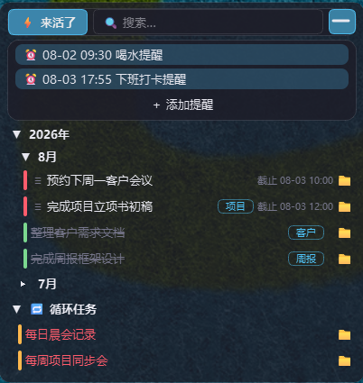
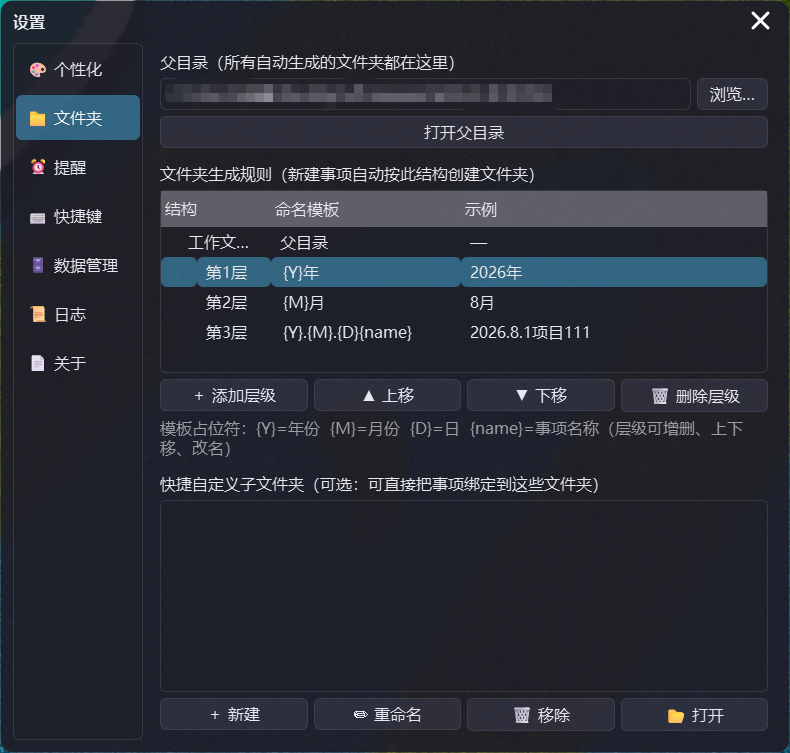
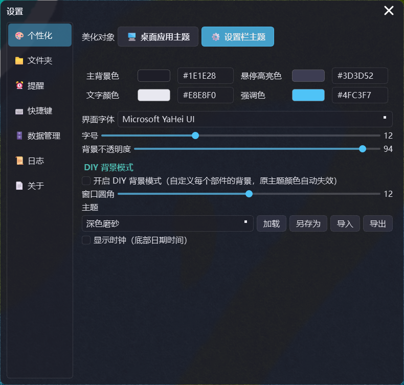

# ZhaxxxxxxQAQ —— 轻量桌面工作记事录

一个贴在桌面上的无边框磨砂悬浮记事挂件：工作记录、待办事项、循环任务、定时提醒、下班倒计时。
**完全本地离线运行**，所有数据保存在程序目录内，不需要联网、不收集任何信息。




## ✨ 核心亮点：自动创建项目文件夹，一键直达

**打工人福音。** 记录一项工作时，无需再手动建文件夹：

- 添加事项时自动按规则生成文件夹结构：`工作文件夹\2026年\7月\2026.7.31事项名`（年份/月份/项目层级可自定义，重名自动加序号）
- 循环任务自动归入 `工作文件夹\循环任务\任务名`
- 点击事项右侧的 **📁 图标一键打开**对应文件夹——已绑定直接进，未绑定自动创建
- 也可手动绑定任意文件夹 / 绑定自定义子文件夹，随时改绑、解绑
- 归档从此有条理：所有资料自动按 年 → 月 → 项目 归档，找东西再也不靠回忆



## 功能特性

- **无边框磨砂悬浮窗**：贴在桌面层、不进任务栏，仅系统托盘驻留；支持拖拽、八向边缘缩放、位置记忆
- **⚡ 来活了**：一键添加待办（开始新工作）、登记以往工作（自定义历史时间）、循环任务、一次性提醒
- **三层收纳**：工作记录/待办按「年 → 月 → 当月任务」折叠展开，窗口高度随内容自适应
- **循环任务**：每天/每周/每月/每季/每年，独立分区，支持"完成当期"与完成历史
- **定时提醒**：待办截止提醒（可提前）、循环任务提醒、一次性提醒弹窗（完成/稍后 5/30/60 分钟/自定义）
- **下班倒计时**：窗口底部时钟 + 距下班时间（可定制文案与格式，工作日自动识别）
- **📁 文件夹绑定**：按规则自动生成 `工作文件夹\2026年\7月\2026.7.31事项名` 结构，或手动绑定/自定义子文件夹（见上方「核心亮点」）
- **DIY 背景**：每个部件（主面板/头部/提醒栏/时钟/对话框）可单独设置纯色或图片背景 + 透明度
- **个性化主题**：主窗口与设置窗独立配色，屏幕吸管取色、字体字号、背景透明度、圆角、明暗双主题、主题导入导出


- **全局快捷键**：默认 `Ctrl+Shift+Z+X` 呼出设置、`Ctrl+Shift+Z+P` 切换鼠标穿透；可自定义四键组合
- **紧凑模式**：缩成迷你悬浮条只显示最紧急事项，点击展开；长按拖拽移动、边缘横向缩放
- **数据管理**：全文搜索、类型筛选、JSON/CSV 导出导入（防重复）、防误删确认、标签管理、循环完成历史
- **开机自启**：注册表 Run 项，可在设置中开关
- **轻量**：待机 CPU 占用接近 0，内存占用约 100-200MB，安装包约 19MB

## 安装

在 [Releases](https://github.com/HeartAE866/ZhaxxxxxxQAQ/releases) 下载最新版安装包
（`ZhaxxxxxxQAQ_Setup_v1.1.3.exe`），双击安装即可。

> Windows 10/11（64 位）。完全本地离线，卸载只需删除安装目录。

## 源码运行（开发）

```bash
# Python 3.10+（开发环境使用 3.14）
python -m venv venv
venv\Scripts\activate
pip install -r requirements.txt

# 日常静默启动（无黑窗口）
wscript.exe ZhaxxxxxxQAQ.vbs

# 调试启动（带控制台）
启动 ZhaxxxxxxQAQ.bat
```

托盘图标默认优先读取用户桌面上的 `图标.png`，不存在时回退到打包内 `resources\tray.png`；
打赏码同理回退 `resources\donation.png`，删除即可移除"关于"页打赏入口。

## 打包发布

```bash
# 1. PyInstaller 打包
python -m PyInstaller --noconfirm --clean --windowed --name ZhaxxxxxxQAQ ^
  --icon "resources\tray_round.ico" --add-data "resources;resources" ^
  --exclude-module PySide6.QtQuick --exclude-module PySide6.QtQml ^
  --exclude-module PySide6.QtPdf --exclude-module PySide6.QtOpenGL ^
  --exclude-module PySide6.QtOpenGLWidgets --exclude-module PySide6.QtNetwork ^
  --exclude-module PySide6.QtSvg --exclude-module PySide6.QtVirtualKeyboard ^
  --exclude-module PySide6.QtWebSockets --exclude-module PySide6.QtTest app\main.py

# 2. 裁剪未用的 Qt 模块（约 64MB → 58MB）
#    删除 dist\ZhaxxxxxxQAQ\_internal\PySide6\ 下的 Qt6Quick/Qt6Qml/Qt6Pdf/Qt6OpenGL/
#    Qt6Network/Qt6Svg/Qt6VirtualKeyboard/opengl32sw/translations 等（见 .gitignore 注释外的发布脚本）

# 3. Inno Setup 生成安装包（见 docs 或历史提交中的 build_setup.iss）
```

## 目录结构

```
ZhaxxxxxxQAQ\
├── ZhaxxxxxxQAQ.vbs         静默启动器（开机自启指向它）
├── 启动 ZhaxxxxxxQAQ.bat     调试用启动器（带控制台）
├── requirements.txt          Python 依赖
├── app\                     程序源码（main.py 入口，core/settings/editor/widgets 等模块）
├── resources\               图标、logo、默认打赏码
├── config.json              全部设置（运行时生成，不入库）
├── data\data.json           全部事项数据（运行时生成，不入库）
├── logs\                    运行/错误日志（运行时生成，不入库）
└── 工作文件夹\               事项绑定的默认工作目录（运行时生成，不入库）
```

## 许可证

[MIT](LICENSE) © ZhaxxxxxxQAQ

本应用完全开源且免费，任何向你收费的都是骗子。
