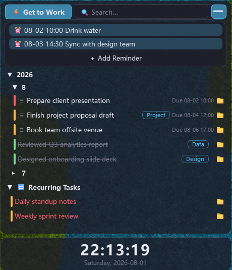
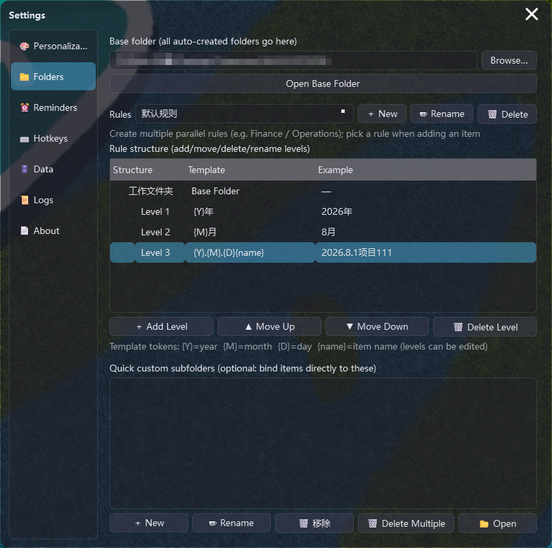
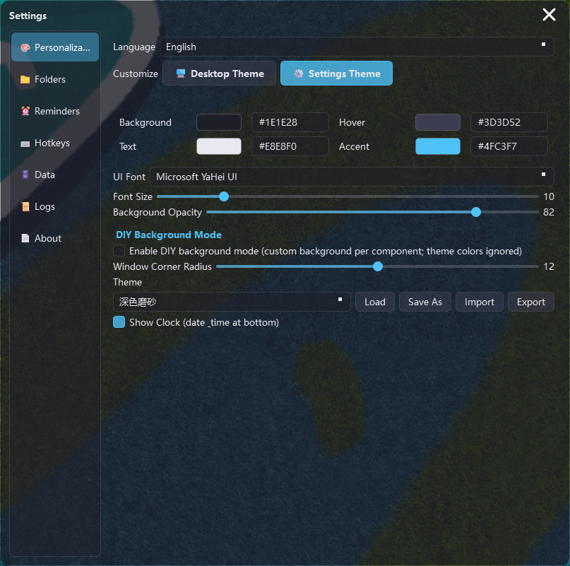

# ZhaxxxxxxQAQ — Lightweight Desktop Work Journal

A frameless, frosted-glass floating widget that sits on your desktop: work logs, todos, recurring tasks, reminders, and an off-work countdown.
**100% local and offline** — all data stays in the app folder. No accounts, no cloud, no tracking.


> 🌐 中文介绍请看 [README.md](README.md)



## ✨ Killer Feature: Auto-Created Project Folders, One-Click Access

**A blessing for working people.** No more manual folder creation:

- When you log a task, a folder structure is auto-created: `Work Folder\2026\07\2026.7.31TaskName` (year/month/project levels are fully customizable; duplicates get auto-numbered)
- Recurring tasks go to `Work Folder\Recurring\TaskName`
- Click the **📁 icon** next to any item to open its folder instantly — bound folders open directly, unbound ones are created on the fly
- **Multiple parallel rules**: create several rules (e.g. Finance / Operations) and pick the right one per task — finance items go to the finance path, operations to the operations path
- Manual binding, custom subfolders, rebinding and unbinding are all supported
- Everything stays organized by Year → Month → Project automatically



## Features

- **Frameless frosted floating window**: sits on the desktop layer, no taskbar entry, tray-only; drag, 8-direction edge resize, position memory
- **⚡ Get to Work**: one-click add todos, log past work (pick the time), recurring tasks, one-time reminders
- **Year → Month → Task grouping**: collapsible sections, window height auto-fits content
- **Recurring tasks**: daily/weekly/monthly/quarterly/yearly, with "complete current" and history
- **Reminders**: todo deadline reminders (with advance time), recurring task alerts, one-time reminder popups (Done / Snooze 5·30·60 min / custom)
- **Off-work countdown**: live clock + time-until-off-work (customizable text & format, workday-aware)
- **DIY backgrounds**: per-component background (solid color or image + opacity) for panel/header/reminder bar/clock/dialogs
- **Theming**: independent themes for the desktop window and settings window, on-screen color picker (eyedropper), fonts, opacity, corner radius, light/dark presets, theme import/export
- **Global hotkeys**: `Ctrl+Shift+Z+X` opens settings, `Ctrl+Shift+Z+P` toggles click-through; custom 4-key combos
- **Compact mode**: collapse into a mini bar showing the most urgent item; click to expand, drag to move
- **Data management**: full-text search, type filters, JSON/CSV export/import (duplicate-safe), guarded deletion, tag manager, recurring history
- **Auto-start**: registry Run key, toggleable in settings
- **🌐 Bilingual**: Simplified Chinese / English UI, switchable in Settings → Personalization
- **Lightweight**: ~0% CPU when idle, ~19 MB installer



## Install

Download the latest installer from [Releases](https://github.com/HeartAE866/ZhaxxxxxxQAQ/releases)
(`ZhaxxxxxxQAQ_Setup_v1.3.0.exe`) and run it.

**For users in China**: if GitHub is slow or unreachable, use the domestic mirror repository
[Gitee Mirror](https://gitee.com/HeartAE86/ZhaxxxxxxQAQ) (search "Gitee ZhaxxxxxxQAQ" to find it);
the in-app auto-update switches to the China mirror automatically — no VPN needed.

> Windows 10/11 (64-bit). Fully offline — uninstall by deleting the app folder.

## Run from Source (Development)

```bash
# Python 3.10+ (3.14 used in development)
python -m venv venv
venv\Scripts\activate
pip install -r requirements.txt

# Silent launch (no console window)
wscript.exe ZhaxxxxxxQAQ.vbs

# Debug launch (with console)
启动 ZhaxxxxxxQAQ.bat
```

The tray icon prefers a `图标.png` on the user's Desktop and falls back to `resources\tray.png`;
same for the donation QR (`赞赏码.png` on Desktop, fallback `resources\donation.png` — delete to hide the donation entry).

## Packaging

```bash
python -m PyInstaller --noconfirm --clean --windowed --name ZhaxxxxxxQAQ ^
  --icon "resources\tray_round.ico" --add-data "resources;resources" ^
  --exclude-module PySide6.QtQuick --exclude-module PySide6.QtQml ^
  --exclude-module PySide6.QtPdf --exclude-module PySide6.QtOpenGL ^
  --exclude-module PySide6.QtOpenGLWidgets --exclude-module PySide6.QtNetwork ^
  --exclude-module PySide6.QtSvg --exclude-module PySide6.QtVirtualKeyboard ^
  --exclude-module PySide6.QtWebSockets --exclude-module PySide6.QtTest app\main.py
# Then prune unused Qt DLLs in dist\ZhaxxxxxxQAQ\_internal\PySide6\ (Qt6Quick/Qml/Pdf/OpenGL/Network/Svg/VirtualKeyboard/opengl32sw/translations) and build with Inno Setup.
```

## Directory Layout

```
ZhaxxxxxxQAQ\
├── ZhaxxxxxxQAQ.vbs         Silent launcher (used by auto-start)
├── 启动 ZhaxxxxxxQAQ.bat     Debug launcher (with console)
├── requirements.txt          Python dependencies
├── app\                     Source code (main.py entry; core/settings/editor/widgets modules)
├── resources\               Icons, logo, default donation QR
├── config.json              All settings (generated at runtime, not tracked)
├── data\data.json           All item data (generated at runtime, not tracked)
├── logs\                    Runtime/error logs (generated at runtime, not tracked)
└── 工作文件夹\                Default work folder for bound items (generated at runtime, not tracked)
```

## License

[MIT](LICENSE) © ZhaxxxxxxQAQ

Fully open source and free. Anyone charging you for this app is a scammer.
